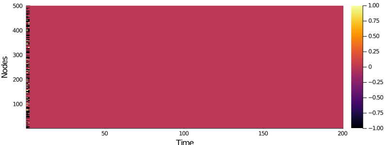

# julia-nbs
Notebooks with little things implemented in Julia

## SER Model
A model of spreading excitations used in many disciplines (propagation of forest-fires, spread of epidemics, neuronal dynamics, etc.).  
SER stands for susceptible, excited and refractory.

